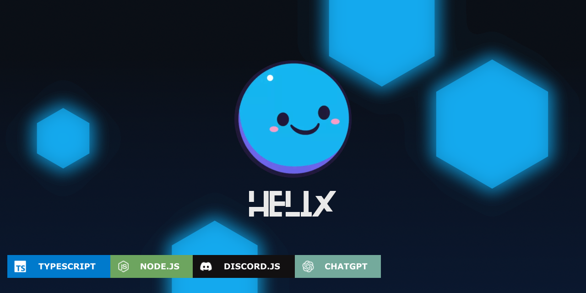

<h1 align="center">
    
    <br />
    <b>Helix</b>
</h1>

<div align="center">
    <a href="https://discord.gg/GampaCt/">
        
    </a>
    <a href="https://svelte.dev/">
        
    </a>
    <a href="https://js.org/">
        
    </a>
    <a href="https://nodejs.org/">
        
    </a>
    <a href="https://www.typescriptlang.org/">
        
    </a>
    <a href="https://chat.openai.com/">
        
    </a>
    <a href="https://discord.js.org/">
        
    </a>
    <br>
    <a href="https://discord.gg/GapmaCt">
        
    </a>
    <br>
    <a href="/LICENSE.md">
        
    </a>
</div>

---

<p align="center"><b>The official repository for Helix, a multipurpose Discord bot.</b></p>

---

## 📖 About Helix

Helix is a multipurpose Discord bot designed to help you manage, moderate, and enhance your server with ease. Created as a personal project to deepen my understanding of JavaScript, TypeScript, APIs, and modern programming concepts, Helix now offers a robust set of features for communities of all sizes.

---

## ✨ Features

- **Music**: High-quality music playback (coming soon)
- **Moderation**: Powerful moderation tools (coming soon)
- **Auto-moderation**: Automated server protection (coming soon)
- **AI Integration**: ChatGPT-powered conversations (coming soon)
- **Image Manipulation**: Fun and useful image tools (coming soon)

---

## 🗂️ Modules

<details>
  <summary><b>Click to expand module details</b></summary>

  - 🎵 **Music**: coming soon
  - ⚒️ **Moderation**: coming soon
  - 🦾 **AI (ChatGPT)**: coming soon
  - 🖼️ **Image Manipulation**: coming soon

</details>

---

## 📝 To-Do List

| Module           | Status |
|------------------|:------:|
| More coming soon |   -    |

---

## 🏷️ Version Legend

| Symbol | Meaning              |
|:------:|----------------------|
| 🔴     | Discontinued         |
| 🟡     | Inactive             |
| 🟢     | Active               |
| 🔵     | Beta                 |
| ⚪     | Alpha                |
| 🟣     | Unofficial/Private   |
| Ⓜ️     | Very Active          |
| ✅     | Full AI              |
| 🤖     | Partial AI           |
| ❌     | No AI                |
| ⚗️     | In Progress          |
| 🛟     | Life Support         |

---

## 🗃️ Versions

| Core      | Version(s)         | Codename        | Status | API | Engine           | AI      | Notes                |
|-----------|--------------------|-----------------|:------:|:---:|------------------|:-------:|----------------------|
| ---       | v1.0.0 → 1.1.8     | Rootspawn       | 🔴     | 6   | D.js 12.2.0      | ❌      |                      |
| ---       | v2.0.0 → 2.6.0     | Loopback        | 🔴     | 7   | D.js 12.4.1      | ❌      |                      |
| ---       | v3.0.0 → 3.5.0     | EchoRun         | 🛟     | 7   | D.js 12.5.2      | ❌      |                      |
| ---       | v4.0.0 → 4.1.2     | Neatline        | 🔴     | 7   | D.js 12.5.3      | ❌      |                      |
| ---       | v5.0.0             | Ghostping       | 🟡     | 8   | D.js 13.6.0      | ❌      |                      |
| ---       | v5.1.0             | Signalband      | 🟢     | 9   | D.js 13.11.0     | ❌      |                       |
| ---       | v6.0.0             | Dataloom        | 🔴     | 9   | D.js 13.14.0     | ❌      |                      |
| ---       | v6.1.0             | Protothype      | 🔵     | 9   | D.js 14.9.0      | ✅      |                      |
| ---       | v7.0.0             | Cleancut        | 🔴     | 9   | D.js 14.11.0     | ⚗️      |                      |
| Hex_1     | v9.0.0 → 9.0.6     | Stackflow       | 🔴     | 10  | D.js 14.6.0      | ⚗️      | Deprecated in favor of Carbonkernel |
| Hex_2     | v10.0.0            | Carbonkernel    | Ⓜ️     | 10  | D.js 14.18.0     | ⚗️      |Future version of Helix|
| Cranberry | x                  | Cranberry       | 🟣     | 10  | D.js 14.14.1     | 🤖      |Private bot. Used for moderating the Helix server|

> v9.0+ runs on [Paperplane](https://github.com/Helix-Labs/framework), a custom fork of [Sapphire](https://github.com/sapphiredev/framework).

---

## 📚 Documentation & Support

- **[Website](https://helix.angellabs.xyz/)**
- **[Add Helix to your server](https://discord.com/oauth2/authorize?client_id=723697439638290482&scope=bot&permissions=481684598)**
- **[Discord Support Server](https://discord.gg/GapmaCt)**

---

## 🙏 Credits

- [Sapphire](https://github.com/sapphiredev/framework)
- [Paperplane](https://github.com/Helix-Labs/framework) (fork of Sapphire)

---

## 📜 License

```coming soon```

---

<!--


-->

## ⭐ Star History

<a href="https://www.star-history.com/#4ngel2769/Helix&Date">
 <picture>
   <source media="(prefers-color-scheme: dark)" srcset="https://api.star-history.com/svg?repos=4ngel2769/Helix&type=Date&theme=dark" />
   <source media="(prefers-color-scheme: light)" srcset="https://api.star-history.com/svg?repos=4ngel2769/Helix&type=Date" />
   
 </picture>
</a>